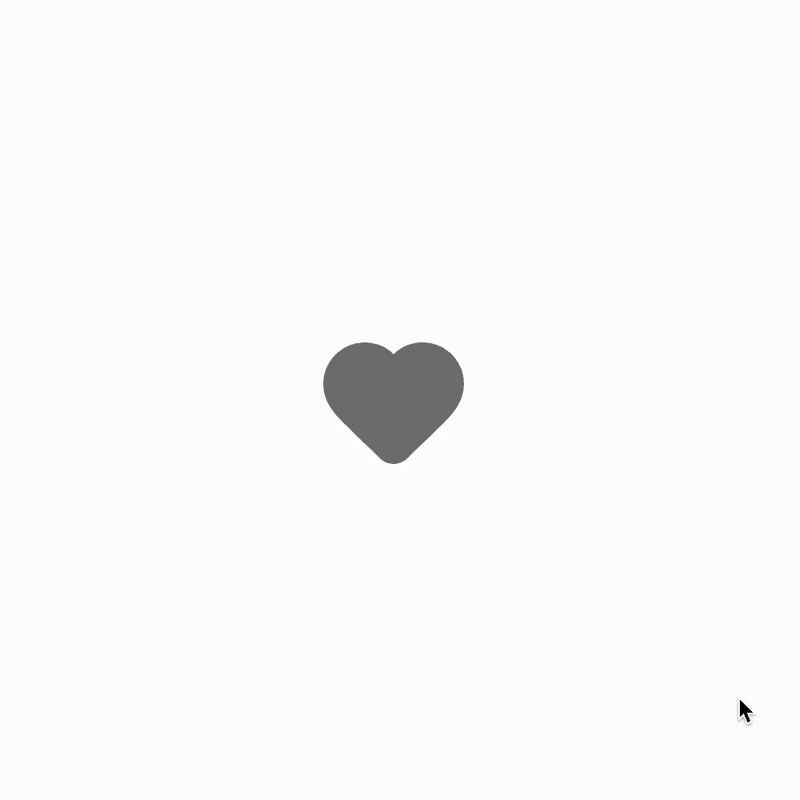
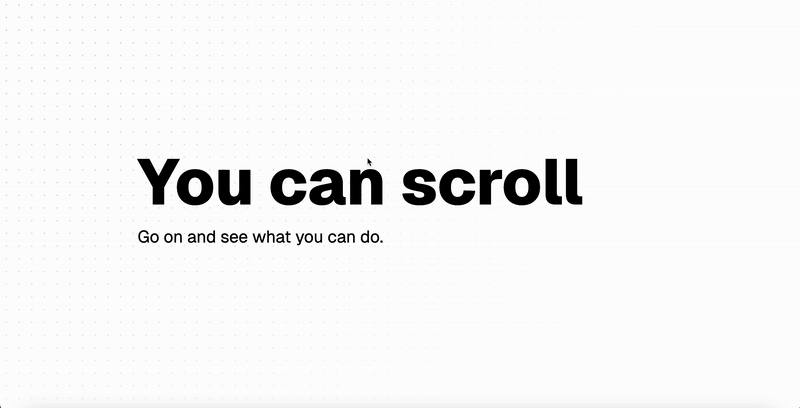

# motion-demos

A collection of modern web animation demos by Andrii Kycha.

These experiments are inspired by independent developers exploring new visual patterns and pushing the aesthetics of the Web.

## Latest Work

[CSS Like Button Animation (SVG Ripple + Particles)](./like-button)

[Kinetic Scroll](./kinetic-scroll)

## Navigating the repo

Each demo is self-contained in its own directory.  
Open a folder to see the demo description, implementation details, and previews.

## Index

- [CSS Like Button Animation (SVG Ripple + Particles)](./like-button)
- [Kinetic Scroll](./kinetic-scroll)
